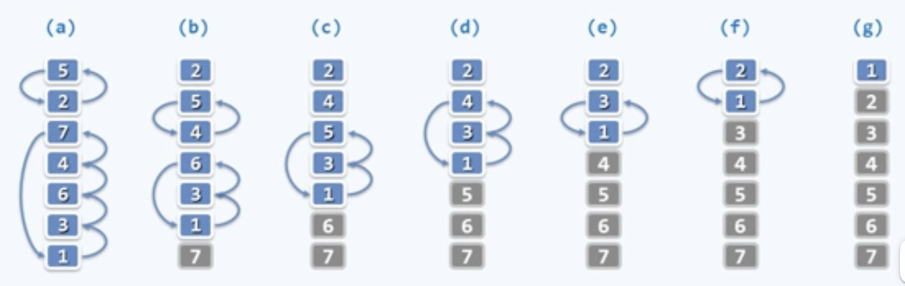

# 排序

问题：给定$`n`$个整数，将它们按（非降）序排列

## 冒泡排序 
观察：有序/无序序列中，任意/总有一堆相邻元素/逆序

扫描交换：依次比较每一对相邻元素，如有必要，交换之。若整趟扫描都没有进行交换，则排序完成；否则，再做一趟扫描交换。

问题：该算法必然会结束？至多需迭代多少趟？

不变性：经过k轮扫描交换后，最大的k个元素必然就位。

单调性：经过k轮扫描交换后，问题规模缩减至n-k

正确性：经过至多n趟扫描后，算法必然终止，且能给出正确解答

> 算法分析中，通过不变性和单调性推导出正确性是很常用的方法。

---

[父目录](../ReadME.md)