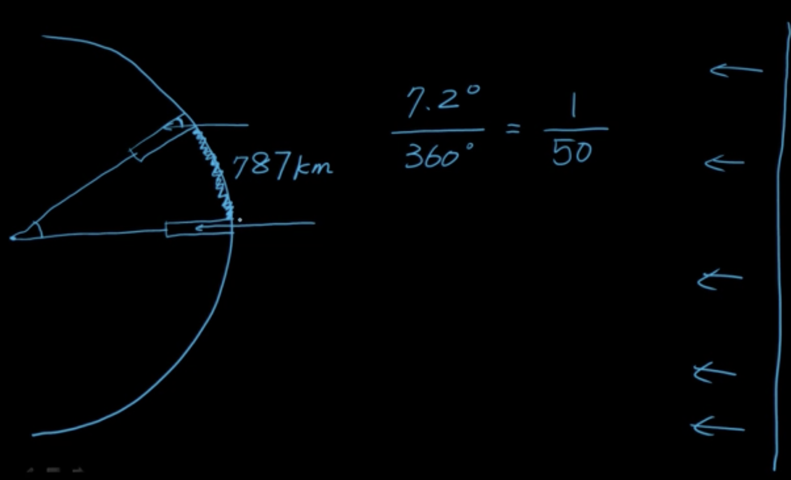

### 封笔计算

Back-Of-The-Envelope Calculation：是指不用笔，仅用一种大脑就能快速算出的方法来估计。

大物理学家 费曼 根据纸张估算出的原子弹爆炸当量与精细计算后的结果相差仅两倍的关系。

艾拉托斯托尼估算地球直径方法：

1. 在亚历山大打了一口井， 在夏至当天，光照垂直打到井底
2. 同样的时间在另一个地方打了一口井，同样的时间，阳光在这个地方打下了一个阴影
3. 只要根据阴影计算出光线与井的夹角，就可以知道，两地关于地心连线的夹角，从而根据两地之间的直线距离就能算出来地球的周长。

**时间的快速估算**：

- 1天 = 24hr * 60min * 60sec = 25 * 4000 = 10^5 sec

- 1生 = 1世纪 = 100yr * 365 = 3 * 10^4 day = 3 * 10^9 sec

- 五十年 = 1.6 * 10^9 sec

- 三生三世 = 300yr = 10^10 sec

- 宇宙大爆炸至今 = 10 ^ 21 sec = 10 * (10 ^ 10) ^ 2 sec

实例：

考察队全国人口普查数据进行排序，n = 10^9

---

[父目录](../ReadME.md)