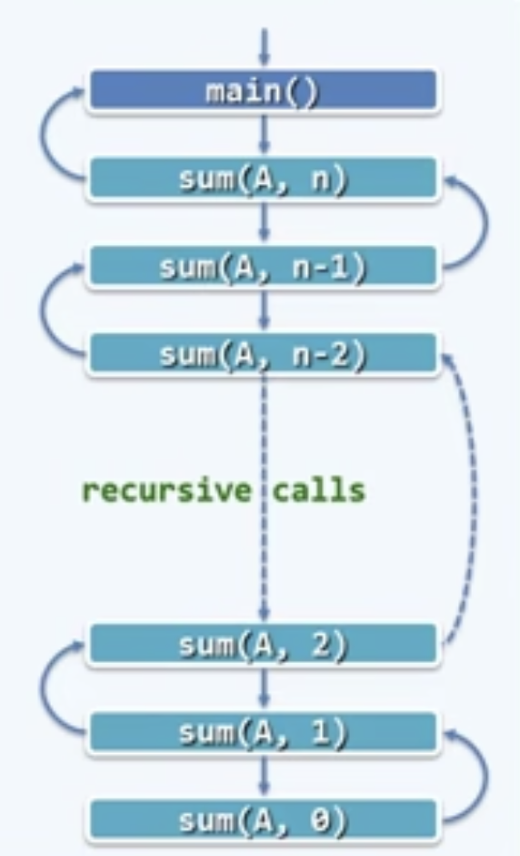

# 迭代与递归

迭代乃人工，递归方神通

## 迭代

### 数组求和

问题：计算任意$`n`$个整数之和

时间复杂度：$`T(n) = 1 + n*1 + 1 = n + 2 = O(n)`$

空间复杂度：$`O(1)`$

### 数组中找到最大的两个元素

从数组区间A[lo, hi)中找出最大的两个整数A[x1]和A[x2]。元素比较大次数要求尽可能的少。

迭代的方法最简单，最容易想到的是通过两轮遍历，找出最大的两个值。第一遍遍历找出最大值，第二轮从最大值的下标往两边遍历找出次大值。

```cpp
def Iter_find_two_max
```

第二种迭代方法，每一次都用两个指针维护两个已经找到的最大值，每一次遍历新元素时都先和较小的值比较，如果不大于较小值，则遍历下一个元素，否则交换新元素和维护的两个指针中较小的元素。然后再比较这两个指针维护的元素，根据比较结果刷新。

## 递归

### 减而治之（Decrease and Concur）

#### fibnacci问题的递归解法

fibnacci问题是典型的可以用递归方法进行求解的，因为其公式定义就是递归定义的：$`F_n = F_{n-1} + F_{n-2}`$，其中$`F_1 = 1, F_2 = 1`$。

```cpp
def RecurFib(int n)
{
    return (n > 2) ? Fib(n-2) + Fib(n-1) : n;
}
```

但是这个方法时间复杂度非常的高，我们分析一下：

递推式：$`T_n = T_{n-1} + T_{n-2} \approx (\frac{1 + \sqrt{5}}{2})^n`$，这个结果是非多项式的，可以认为这种算法是一种非常差的方法。

封笔估算时间：$`(\frac{1 + \sqrt{5}}{2})^{36} \approx 2^{25} `$；$`(\frac{1 + \sqrt{5}}{2})^{43} \approx 2^{30} \approx 10^9flop \approx 1sec`$

$`\Phi^5 \approx 10`$，其中$`\Phi = \frac{1 + \sqrt{5}}{2}`$

递归版本的Fib算法低效的原因在于各个递归实例均被大量重复的调用。

#### 数组求和

为求解一个大规模的问题，可以：将其划分为两个子问题：其一平凡，另一规模缩减，分别求解子问题。由子问题的解，得到原始问题的解。这样的策略就是减而治之。


**递归跟踪分析**：

检查每个递归实例，累计所需时间（调用语句本身，计入对应的子实例），其总和即算法执行时间



本例中，单个递归实例自身只需$`O(1)`$，总的时间复杂度为$`T(n) = O(1) * (n + 1) = O(n)`$

从递推的角度看，为求解sum(A,n)，需要递归求解规模为n-1的问题sum(A, n-1)，再加上A[n-1]。递归基：sum(A,0)。

递推方程为：$`T(n) = T(n-1) + O(1)`$, $`T(0) = 1`$。

#### 数组倒置

任意给定数组A[0, n]，将其前后颠倒。

```cpp
void RecurseReverse(int *A, int lo, int hi)
{
    if (hi <= lo) { // O(1)
        return;
    }
    int tmp = A[lo]; // O(1)
    A[lo] = A[hi]; // O(1)
    A[hi] = tmp; // O(1)
    RecurseReverse(A, lo + 1, hi - 1); // T(n-2)
}
```

递推方程：$T(n) = T(n-2) + 4$，$T(0) = 1, T(-1) = 1$

### 分而治之

当把原始分题递归式的分为两个规模小的子问题进行求解。

#### 数组求和

```cpp
// 分而治之
int RecurSumDivideConcur(int A[], int lo, int hi)
{
    if (lo == hi) return A[lo];
    int mi = (lo + hi) >> 1;
    return RecurSumDivideConcur(A, lo, mi) + RecurSumDivideConcur(A, mi + 1, hi);
}
```

分而治之方法的递归跟踪图一般都是二叉树，对应的时间复杂度就是2的几何级数，而几何级数的阶数和数的叶子结点个数同阶层，从而可以知道叶子结点的个数就是其时间复杂度。

#### 数组寻找最大的两个元素

该问题使用分而治之地方法可以有效降低计算复杂度：

思路如下：，将原问题分解为两个规模为原问题一半的子问题，子问题各自返回自己找到的最大和次大值，再原问题中将两个子问题返回的四个值进行比较，从而找到最终的结果。

分：对区间折半
合：对子问题返回的值进行比较

退换情形（边界情形）：当区间内元素个数为2、3时不能在继续分，因此这两种情况为边界情形。对他们的处理就是简单的比较并返回找到的结果。
```cpp
std::pair<int, int> RecurFindTwoNumDivideConcur(int *A, int lo, int hi)
{
    if (hi - lo == 1) {
        int first = (A[lo] > A[hi] ? A[lo] : A[hi]);
        int second = A[lo];
        if (first == second) {
            second = A[hi];
        }
        return std::make_pair(first, second);
    }
    if (hi - lo == 2) {
        std::pair<int, int> L = RecurFindTwoNumDivideConcur(A, lo, lo + 1);
        if (L.first < A[hi]) {
            L.second = L.first;
            L.first = A[hi];
        } else if (L.second < A[hi]) {
            L.second = A[hi];
        }
        return L;
    }
    int mi = (lo + hi) >> 1;
    std::pair<int, int> L = RecurFindTwoNumDivideConcur(A, lo, mi);
    std::pair<int, int> R = RecurFindTwoNumDivideConcur(A, mi + 1, hi);
    std::pair<int, int> ret = {0, 0};
    if (L.first > R.first) {
        ret.first = L.first;
        if (L.second > R.first) {
            ret.second = L.second;
        } else {
            ret.second = R.first;
        }
    } else {
        ret.first = R.first;
        if (R.second > L.first) {
            ret.second = R.second;
        } else {
            ret.second = L.first;
        }
    }
    return ret;
}
```

### 记忆递归法

将已经计算过的实例结果制表备查，可以减少一些重复的递归实例计算。从而降低递归的时间复杂度。

注意：更好的方法是用动态规划。